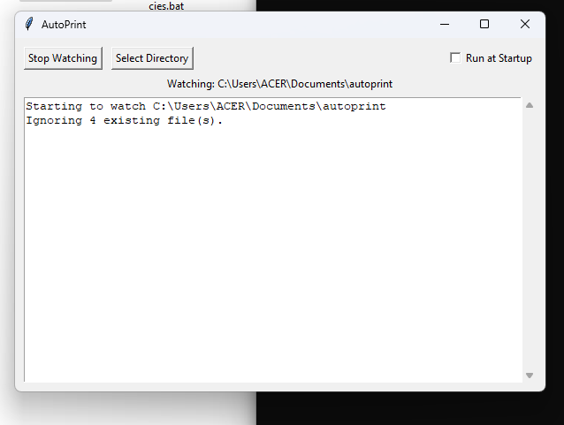

# AutoPrint: Automated File Printing

AutoPrint is a user-friendly Windows application that automatically prints new image and PDF files from a specified directory. It's designed to streamline your printing workflow by eliminating the need for manual intervention.



## Features

*   **Automatic Printing:** Monitors a directory for new `.pdf`, `.png`, `.jpg`, `.jpeg`, and `.bmp` files and prints them automatically.
*   **Image to PDF Conversion:** Automatically converts image files to PDF format before printing, ensuring consistent output.
*   **Customizable Watch Directory:** Choose any directory on your system to monitor for new files.
*   **Run at Startup:** Configure the application to start automatically when you log in to Windows.
*   **Simple User Interface:** An intuitive graphical user interface (GUI) makes it easy to start, stop, and configure the application.
*   **Silent Printing:** Files are printed in the background without any pop-up dialogs.

## Installation

1.  **Clone the repository:**
    ```bash
    git clone https://github.com/navvvdeep/autoprint.git
    ```
2.  **Navigate to the project directory:**
    ```bash
    cd autoprint
    ```
3.  **Install the dependencies:**
    Run the `install_dependencies.bat` file to install the required Python libraries.

## Usage

1.  **Run the application:**
    Execute the `main.py` file to launch the AutoPrint application.
2.  **Select a directory:**
    Click the "Select Directory" button to choose the folder you want to monitor. By default, the application will watch the directory where it is located.
3.  **Start watching:**
    Click the "Start Watching" button to begin monitoring the selected directory.
4.  **Add files:**
    Any new PDF or image files that you add to the directory will be automatically printed.

## Dependencies

*   [Pillow](https://pypi.org/project/pillow/): A powerful image processing library for Python.